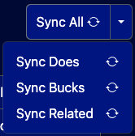
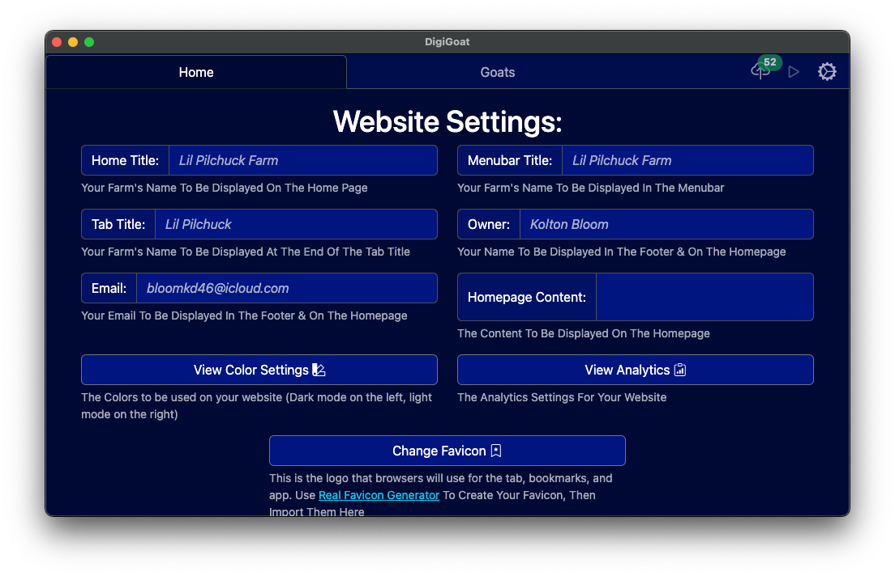
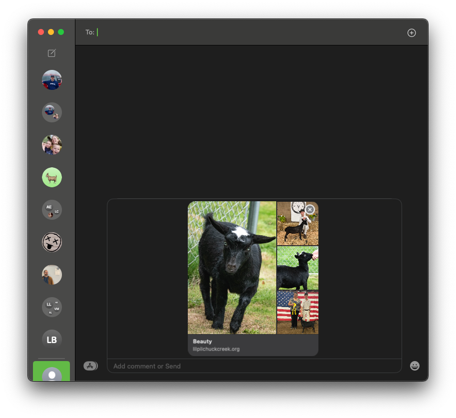
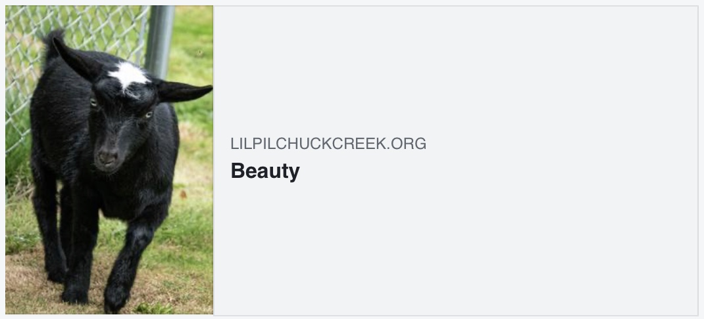
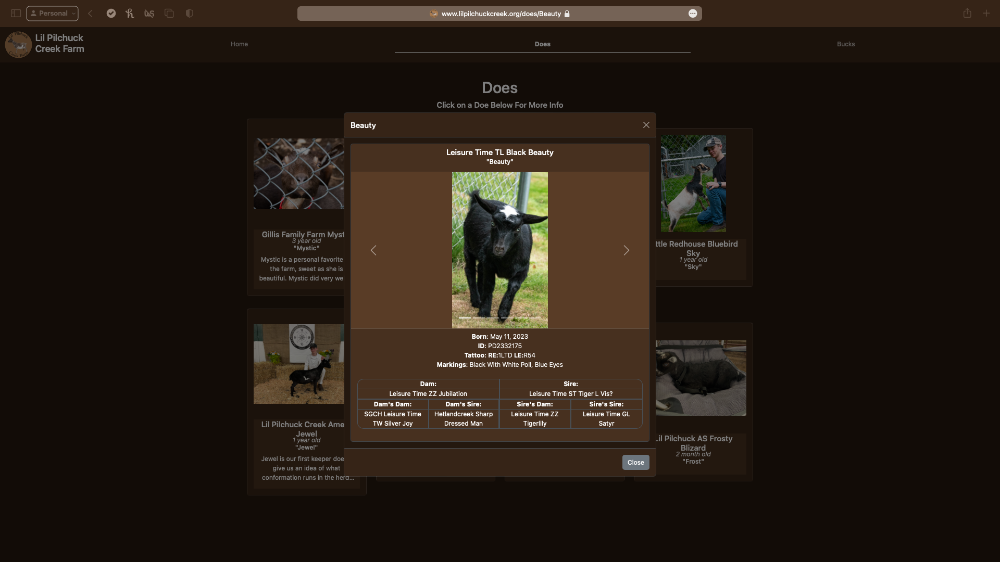
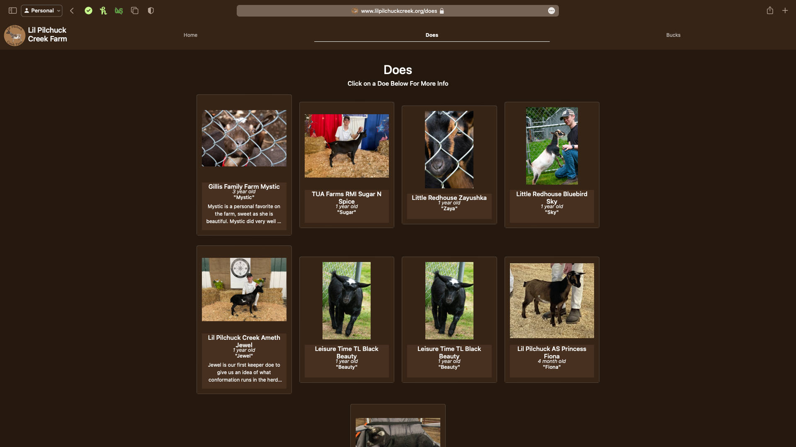
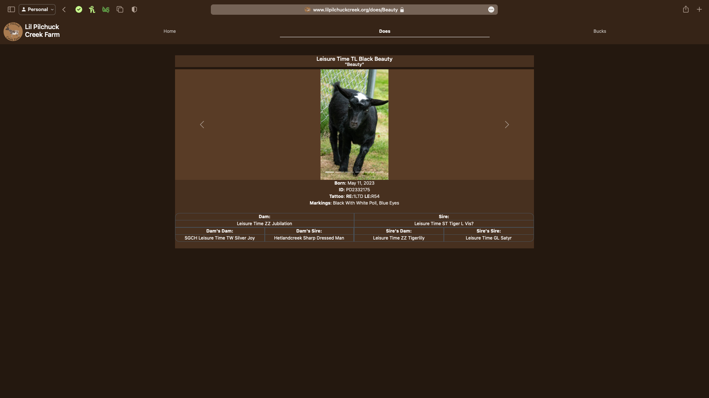
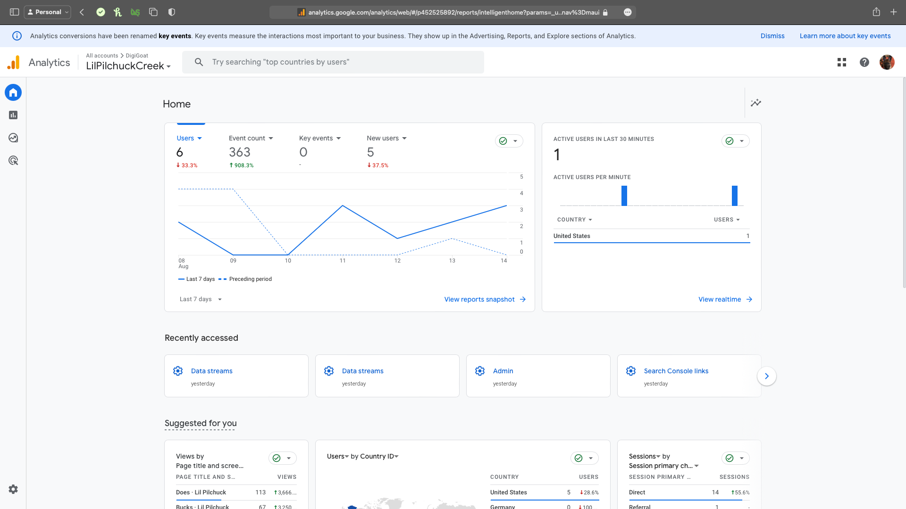
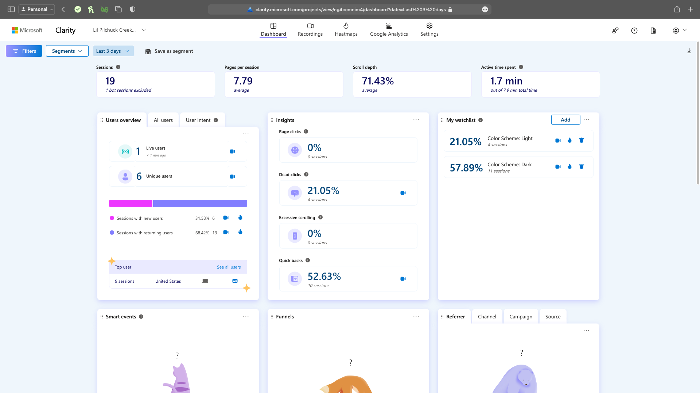
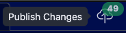

# Features:
## Works with ADGA
No more copy/paste. What used to be hours of entering goats one by one, having to look up the same information each time, is now just the click of a button. When editing your goats, there is a convenient `Sync All` button that fetches all your owned goats, their registration info (such as name, id, etc.), and all the necessary goats (termed "related goats") to automatically construct a pedigree.

## Personalized recommendations
There are some things that just aren't worth your time, like if you're goats barn names are all the last word in their name. Well, now that info is all suggested so all you have to do is click the input box, and voila! It's all entered.

The same goes for when you are setting up your website for the first time. Why try to figure out what to put in all the boxes when it can just tell you?

Whe you see the italicized text, just click!
## Open Graph Protocol
DigiGoat's goat pages support the Open Graph Protocol. This means that when you share a goat's page on social media, it will look good and include the right information. This will include things like your goat's name, description, and pictures
Here's an example of what it would look like when sharing a goat's page on iMessage:

Here's an example of what it would look like when sharing a goat's page on Facebook:

## Optimized For Search Engines
DigiGoat is optimized for search engines. This means that the website will rank higher in search results, which will help more people find it.
What you see:

What a search engine would see on normal websites:

What a search engine would see on a DigiGoat website:

## Analytics Support
DigiGoat comes with built-in support for Google Analytics and Microsoft Clarity. This means that you can track how many people visit your website and what they do on it.
Google Analytics:

Microsoft Clarity:

Microsoft Clarity Recording:

## IndexNow Support
DigiGoat supports IndexNow. This means that when you publish changes to your website, DigiGoat will automatically detect which pages are being modified and notify search engines so that they can update their search results.
## Works offline
The biggest downfall of web-based website editors, is just that, they require access to the web. Which means that it is impossible to put in some new pictures of your favorite goats taking Grand Champion earlier in the day until you get home, at which point you likely won't have time. However, with DigiGoat you cn enter in all those images (and coming soon, show placings) right away, so all you have to do when you get home is hit `Publish Changes`.

## Internet Efficient
Unlike most website editors that require a constant, high speed connection, DigiGoat only uses internet as needed. Such as syncing with ADGA or when you wish to publish changes.
## Open source
Every fragment of this code is fully public for inspection. That way you can rest content that no fishy business is happening in the background
## Community driven
All features will be based off of public request. Have a feature in mind that you want to see come to life? Let me know!
## Personalized support
I'm not some faceless corporation or robot answering machine, I'm a real person who can remember your farm and website setup. No more having to play 20 questions every time you need help with something
## View live preview
One important update for the future will be the ability to preview your site just as it would be seen from the public, without having to publish it first.
## Live preview works offline
Once implemented, the live preview will always be available, without having to have any internet connection!
## Automatic Updates
Using the DigiGoat Client App, your website is automatically updated to include all the latest bug fixes and updates.
## Consistent Layout
DigiGoat has a consistent layout. This means that every page on the website looks the same, which makes it easier to navigate.
## A Page For Each Goat
DigiGoat has a page for each goat. This means that you can learn more about each goat and see pictures of them.
## Markdown Support
DigiGoat supports Markdown. This means that you can use Markdown to easily format text on your website. 
* To learn the syntax, [click here](https://docs.github.com/github/writing-on-github/getting-started-with-writing-and-formatting-on-github/basic-writing-and-formatting-syntax) OR (new!) create a Google Doc, write & style some stuff, then right-click and select `Copy As Markdown`
## Built-In Gestation Calculator
DigiGoat has a built-in gestation calculator. This means that you can easily calculate the due date (or bred date!) of your goats.
## SPA
DigiGoat is a Single Page Application (SPA). This means that the website is faster and more responsive than traditional websites. On traditional websites, every time you click on a link, the entire page has to reload. With DigiGoat, once the website is loaded, it never has to load again.
## Optimized Image Loading
DigiGoat uses a technique called "lazy loading" to load images. This means that images are only loaded when they are needed, which makes the website faster. But don't worry, when opening a goat, the first, second, and last images are loaded immediately so you can see them right away.
## Automated SEO
DigiGoat has automated SEO. This means that the website is optimized for search engines, so you don't have to worry about it.
## Ad-Free
DigiGoat is ad-free. This means that there are no ads on the website, so you can focus on the content.
## Custom Domain
DigiGoat includes a custom domain. This means that you can have your own domain name, like www.yourwebsite.com.
## Custom Emails
DigiGoat includes custom emails. This means that you can have email addresses like info@yourwebsite.com or support@yourwebsite.com.
## Price
DigiGoat is competitively priced at $100/year. This is more than the cheapest plan on WordPress, but has many more features to offer. Additionally, most website builders charge extra for a custom domain.
## Youth Discount
DigiGoat recognizes that $100/year can be a lot of money for a 4-H project. That's why we offer a discount to youth.
## 100% Test Coverage
DigiGoat has 100% test coverage. This means that every part of the website has been tested to ensure that it works correctly.
